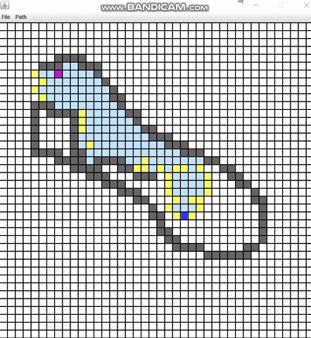

# Path-Finding-Visualization
Visualizing A*, DFS, BFS using Java Swing. Includes providing real-time obstacles, start point, and endpoint nodes.

## Description
Pathfinding Visualizer is a dynamic visualization Java application used to visualize the process of finding the shortest path from some source to destination using bunch of diffrent shortest-path algorithms like A*, Depth-First Search, Breadth-First Search) with awesome functionalites like Controlling the position of the source and destination , randomize obstacles in the grid and clearing the whole grid to add blocks as you like.

#### Additionally, it allows you to : 
- Create a new File
- Save a File
- Open an existing File
- Close the window using Exit option

## Algorithms Implemented

- A* Algorithm
- Depth First Search(DFS)
- Breadth First Search(BFS)

## How it works

- First click on any tile to create the source point (Purple Color)
- Another click on any tile to create the destination point (Dark Blue Color)
- Click and drag the mouse to create the obstacles (Grey Color)
- Select the required Path Algorithm from the Path Dropdown

## Previews

#### Visualizing BFS

#### Visualizing DFS

#### Visualizing A*

#### Other functionalities

